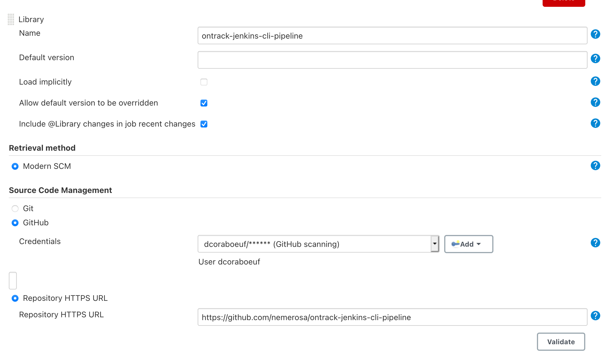

# Ontrack CLI Jenkins Pipeline Library

Jenkins pipeline library using the [Ontrack CLI](https://github.com/nemerosa/ontrack-cli).

## Installation

### JCasC

JCasC (Jenkins Configuration as Code) is the recommended approach:

```yaml
globalLibraries:
    libraries:
    - name: "ontrack-jenkins-cli-pipeline"
      retriever:
        modernSCM:
          scm:
            github:
              configuredByUrl: true
              credentialsId: "<GitHub credentials>"
              repositoryUrl: "https://github.com/nemerosa/ontrack-jenkins-cli-pipeline"
```

### UI

You can also use the Jenkins management UI to register this library:



## Setup

The [steps](#steps) provided by this library, in order to avoid redundant configuration, rely on predefined environment variables and credentials.

> Those environment variables and credentials are not _strictly_ required but they will ease the use of the Ontrack steps.

In most of the cases, you just need to define:

* `ONTRACK_URL` - URL to Ontrack
* `ONTRACK_TOKEN` - secret text credentials entry containing the authentication token used to connect to Ontrack

See [`ontrackCliSetup`](vars/ontrackCliSetup.md) for more information.

## Usage

In your `Jenkinsfile`, declare the version of the pipeline library you want to use and start using the [steps](#steps) provided by the library. For example:

```groovy
@Library("ontrack-jenkins-cli-pipeline@main") _

pipeline {
    agent any
    stages {
        stage("Setup") {
            steps {
                // Ontrack connection & branch setup
                ontrackCliSetup()
            }
        }
        stage("Preparation") {
            steps {
                // Computing a version in VERSION
                // Ontrack build entry creation
                ontrackCliBuild(release: env.VERSION)
            }
        }
    }
}
```

### Versioning

In this example, we use the `main` branch of the pipeline library but it's better to stick to:

* versioned branches, like `v1`
* or explicit tags in order to ensure build reproducibility. See the list of available tags in [GitHub](https://github.com/nemerosa/ontrack-jenkins-cli-pipeline/tags).

## Steps

### General setup

* [`ontrackCliSetup`](vars/ontrackCliSetup.md) - general purpose setup task to set up Ontrack in your pipeline, from connection to initializing project and branch in Ontrack for your pipeline.

### Creating Ontrack items

* [`ontrackCliBuild`](vars/ontrackCliBuild.md) - creates an Ontrack build entry based on current information
* [`ontrackCliValidate`](vars/ontrackCliValidate.md) - creates an Ontrack validation run for the current build, based on current information or provided information

### Technical steps

> Those steps are used internally and will seldom be called directly.

* [`ontrackCliDownload`](vars/ontrackCliDownload.md) - downloads the [Ontrack CLI](https://github.com/nemerosa/ontrack-cli) and sets it into the path
* [`ontrackCliConnect`](vars/ontrackCliConnect.md) - creates a connection configuration for the Ontrack CLI, based on provided information or the environment
